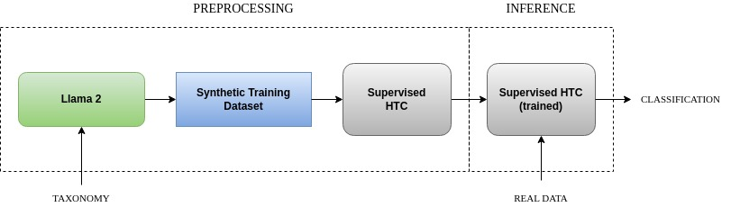

# HTC-GEN (Hieralchical Text Classification Generative)
This is the repository of the Python (3.10+) implementation of HTC-GEN, a state-of-the-art zero-shot approach for Hieralchical Text Classification (HTC), presented as regular paper at [DATA 2024](https://data.scitevents.org/Home.aspx) conference held in Dijon in 9-11/07/2024.



As supervised HTC model, all experiments were conducted with [HGCLR](https://arxiv.org/abs/2203.03825).


# Installation

The code was tested on Ubuntu (Pop!_OS 22.04 LTS) with a single NVIDIA RTX A4000 (16GB).

### Pytorch

---------------

Follow the instructions reported [here](https://pytorch.org/) for the current system.

### Llama 2 

---------------

Download and install Llama 2: https://github.com/meta-llama/llama

### Pandas 

---------------

```sh
> pip install pandas
> pip install openpyxl
```


# Code usage

The code includes source files for the following tasks, considering the case study of [Web of Science](https://data.mendeley.com/datasets/9rw3vkcfy4/6) dataset:

* Virtual-leaves generation
* Items generation from virtual-leaves
* Items generation from leaves

with the following correspondences:

* item: abstract
* leaf: area
* virtual-leaf: keywords


## *Virtual leaves* generation

---------------

This code was designed to build to extend the Web of Science with 20 keywords (virtual leaves) for each Area (leaves).

* filename: [genera_zero_keywords.py](https://github.com/cfabiolongo/HTC-GEN/blob/master/genera_zero_keywords.py)

Relevant parameters:
 
* temperature: Llama 2 temperature (Default=0.6)
* taxonomy: excel file containing the taxonomy. In this case-study case (Web of Science) the taxonomy is: Domain, Y1, Y, area.
* output: text file containing all zero-shot generated items.
* excel_gen: excel file containing all zero-shot generated items and their labels in the taxonomy.

The python code must be launched with:

```sh
torchrun --nproc_per_node 1 genera_zero_keywords.py \
    --ckpt_dir ../llama-2-7b-chat/ \
    --tokenizer_path ../tokenizer.model \
    --max_seq_len 512 --max_batch_size 6  
```

Afterward, the genereted dataset must be filtered with [wos_total_keywords_clean.ipynb](https://github.com/cfabiolongo/HTC-GEN/blob/master/wos_total_keywords_clean.ipynb). 


## *Abstracts* generation from *Virtual leaves*

---------------

This code was designed to generate a synthetic dataset (Web of Science) starting from a dataset containing synthetic keywords generated
in the prior task.

* filename: [genera_zero_daKey_abs.py](https://github.com/cfabiolongo/HTC-GEN/blob/master/genera_zero_daKey_abs.py)

From *real* most frequent 10 keywords from Web of Science:

* filename: [genera_zero_daKey_REAL_abs.py](https://github.com/cfabiolongo/HTC-GEN/blob/master/genera_zero_daKey_REAL_abs.py)


Relevant parameters:
 
* temperature: Llama 2 temperature (Default=0.6)
* taxonomy: excel file containing the taxonomy+keywords (as virtual leaves): Domain, Y1, Y, area, keywords.
* output: text file containing all zero-shot generated items.
* excel_gen: excel file containing all zero-shot generated items and their labels (plus keywords) in the taxonomy.

```sh
torchrun --nproc_per_node 1 genera_zero_daKey_abs.py \
    --ckpt_dir ../llama-2-7b-chat/ \
    --tokenizer_path ../tokenizer.model \
    --max_seq_len 512 --max_batch_size 6  
```

## *Abstracts* generation from *leaves*

---------------

This code was designed to generate a synthetic dataset (Web of Science) starting Web of Science taxonomy.

* filename: [genera_zero_daArea_abs.py](https://github.com/cfabiolongo/HTC-GEN/blob/master/genera_zero_daArea_abs.py)

Relevant parameters:
 
* temperature: Llama 2 temperature (Default=0.6)
* taxonomy: excel file containing the Web of Science taxonomy: Domain, Y1, Y, area.
* output: text file containing all zero-shot generated items.
* excel_gen: excel file containing all zero-shot generated items and their labels in the taxonomy.

```sh
torchrun --nproc_per_node 1 genera_zero_daArea_abs.py \
    --ckpt_dir ../llama-2-7b-chat/ \
    --tokenizer_path ../tokenizer.model \
    --max_seq_len 512 --max_batch_size 6  
```

## Synthetic dataset sizing

---------------

This code was designed to evaluate both dataset generated from leaves and dataset generated from virtual leaves, with the Chamfer Distance Score and Remote Clique Score,
in order to maximize HTC performances.

* filename: [diversity_mean.py](https://github.com/cfabiolongo/HTC-GEN/blob/master/diversity_mean.py)

Relevant parameters (input):
 
* file_name: excel file
* num_classes: #classes
* classe_label: label on the basis of which the score are calculated 
* testo_label: items names

Output:

* Chamfer Distance Score (Avg)
* Remote Clique Score (Avg)